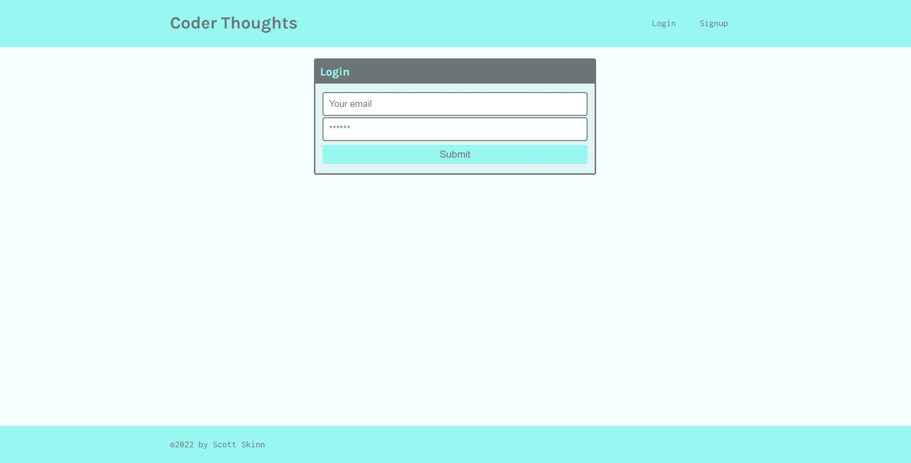
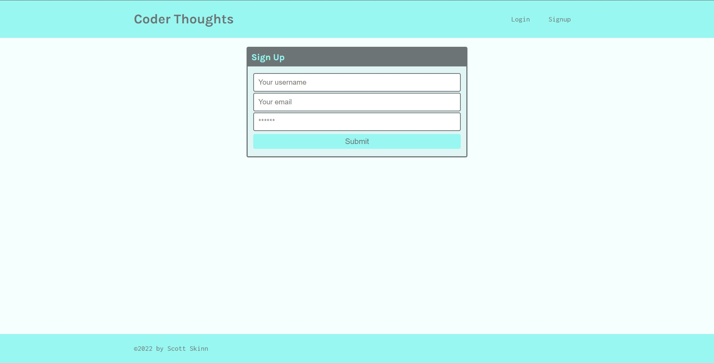
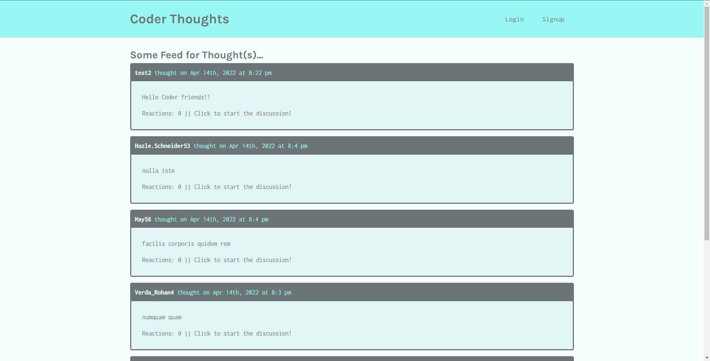
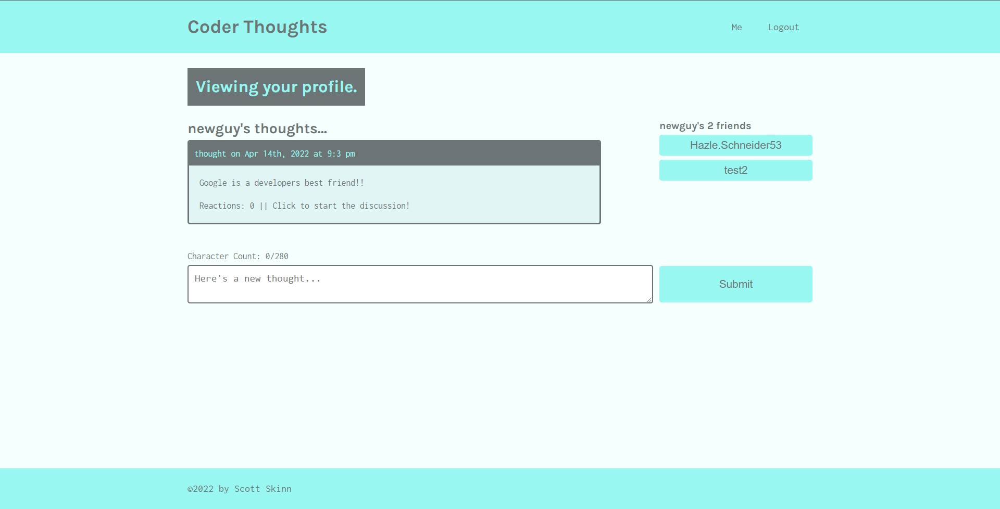

# Coder Thoughts

## Table of Contents

- [Description](#description)
- [Installation](#installation)
- [Usage](#usage)
- [Contributing](#contributing)
- [License](#license)
- [Questions](#questions)

## Description

Users will be able to sign up and create an account, post their thoughts, and interact with other users, just like you might find in the social media apps.

## Installation

<https://tranquil-stream-37498.herokuapp.com/>

## Usage

## Contributing

If you'd like to add anything, fork it and make it your own!

## License

  

## Questions

Reach out to me at any time!

[scottskinn](https://github.com/scottskinn/)

[scottskinn2n@gmail.com](mailto:scottskinn2n@gmail.com)
